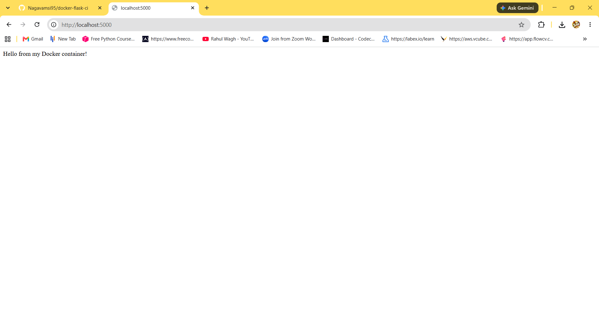
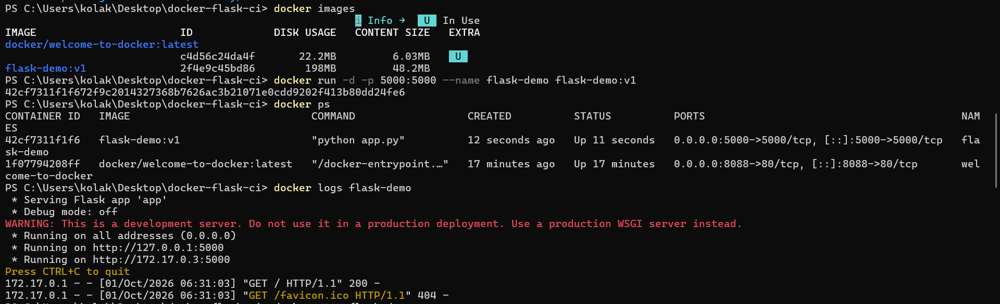
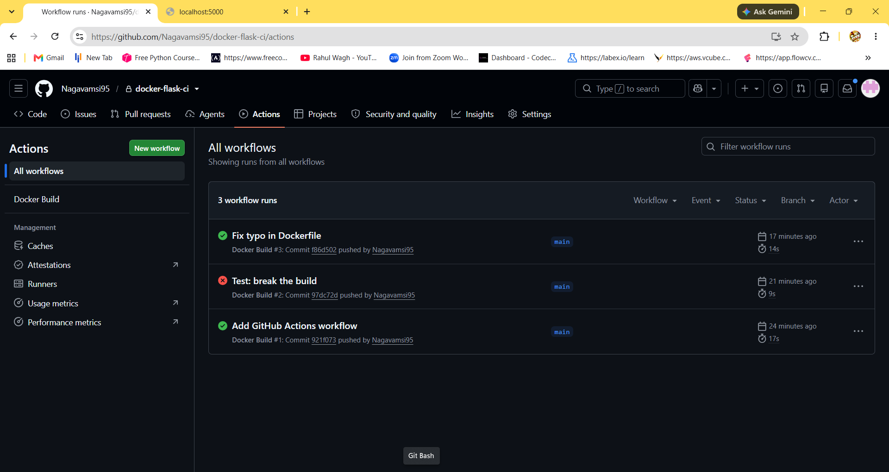

# Dockerized Flask App with GitHub Actions

A small Flask web app packaged in a Docker container. A GitHub Actions workflow builds the Docker image automatically on every push to main.

## Run locally

    docker build -t flask-demo:v1 .
    docker run -d -p 5000:5000 --name flask-demo flask-demo:v1

Then open http://localhost:5000

## What is inside

- app.py - the Flask app
- Dockerfile - builds the image
- .github/workflows/docker-build.yml - the CI workflow

## Screenshots

